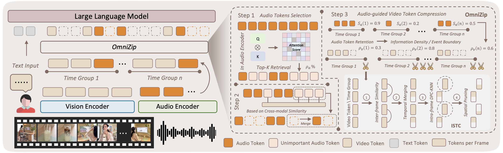
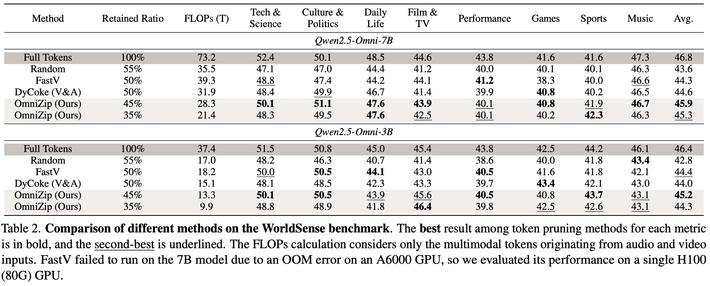
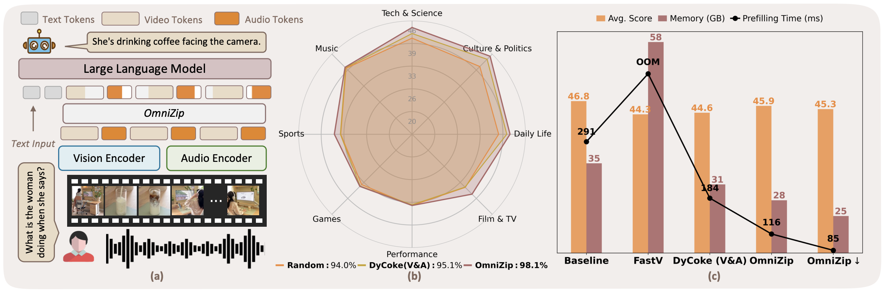

# OmniZip: Audio-Guided Dynamic Token Compression for Fast Omnimodal Large Language Models

[Keda Tao](https://kd-tao.github.io/), [Kele Shao](https://cokeshao.github.io/), [Bohan Yu](), [Weiqiang Wang](), [Jian liu](), [Huan Wang](https://huanwang.tech/), "OmniZip: Audio-Guided Dynamic Token Compression for Fast Omnimodal Large Language Models"

[[Paper](https://arxiv.org/abs/2511.14582)]

#### 🔥🔥🔥 News

- **2025-11-19**: The paper is released.
- **2025-11-18:** This repo is released.





> **Abstract:** Omnimodal large language models (OmniLLMs) have attracted increasing research attention of late towards unified audio-video understanding, wherein processing audio-video token sequences creates a significant computational bottleneck, however. Existing token compression methods have yet to accommodate this emerging need of jointly compressing multimodal tokens. To bridge this gap, we present OmniZip, a training-free, audio-guided audio-visual token-compression framework that optimizes multimodal token representation and accelerates inference. Specifically, OmniZip first identifies salient audio tokens, then computes an audio retention score for each time group to capture information density, thereby dynamically guiding video token pruning and preserving cues from audio anchors enhanced by cross-modal similarity. For each time window, OmniZip compresses the video tokens using an interleaved spatio-temporal scheme. Extensive empirical results demonstrate the merits of OmniZip - it achieves 3.42 $\times$ inference speedup and 1.4 $\times$ memory reduction over other top-performing counterparts, while maintaining performance with no training.

## ⚒️ TODO

* [x] Release code 
* [x] Release paper 
* [ ] Release evaluation script for all benchmarks
* [ ] Support more models

## Install
##### 1. **Clone this repository and navigate to the LLaVA folder:**
```bash
git clone https://github.com/KD-TAO/OmniZip.git
cd OmniZip
```

##### 2. **Install the inference package:**
```bash
conda create -n omnizip python=3.10 -y
conda activate omnizip
pip install --upgrade pip
bash setup.sh

cd lmms-eval
pip install -e .

# Recommend
# pip install torch==2.6.0 torchvision==0.21.0
pip install flash-attn --no-build-isolation
```
#### Input Video Setting
You can adjust the number of input frames and the maximum pixel size according to your own computing resources.
```
VIDEO_MIN_PIXELS = 128 * 28 * 28
VIDEO_MAX_PIXELS = 768 * 28 * 28 # <- 1 (We use 128*28*28 in the paper.)
FRAME_FACTOR = 2
FPS = 2.0
FPS_MIN_FRAMES = 4
FPS_MAX_FRAMES = 768 # <- 2
```

## Quick Start
To have a quick demo of OmniZip with Qwen2.5-Omni, please run
```
python demo.py --omnizip
```
You can set the relevant parameters by
```
python demo.py --omnizip --rho_audio 0.4 --rho_video 0.7
```
## Evaluation
#### For VideoMME (Benchmarks in lmms-eval)
- We use the [lmms-eval](https://github.com/EvolvingLMMs-Lab/lmms-eval) toolkit to evaluate our models. It's worth noting that you can specify OmniZip Settings via parameters in **eval.sh**, such as:
```bash
export WRAPPER=OmniZip
OMNIZIP_RHO_AUDIO=0.3
OMNIZIP_RHO_VIDEO=0.6
OMNIZIP_G=3
OMNIZIP_CONTEXTUAL_RATIO=0.05
...
```
- Then you can run for evaluation
```bash
bash eval.sh
```
#### For Other Benchmark ([AVUT](https://huggingface.co/datasets/tsinghua-ee/AVUTBenchmark), [ShorVid-Bench](https://huggingface.co/datasets/TencentARC/ShortVid-Bench)), and [WorldSense](https://jaaackhongggg.github.io/WorldSense/)

- We prefer use this evaluation method:
```
python eval/eval.py --WAPPER-METHOD omnizip
```


## 👀 Results on Audio-Video Understanding Task




## Acknowledgement

This project is based on [Qwen2.5-Omni](https://github.com/QwenLM/Qwen2.5-Omni). Thanks for their awesome work.

## Contact

If you have any questions, please feel free to contact me at KD.TAO@outlook.com

## Citation

If you find this work useful for your research, please consider citing our paper:

```bibtex
@article{omnizip,
  title={OmniZip: Audio-Guided Dynamic Token Compression for Fast Omnimodal Large Language Models}, 
  author={Keda Tao and Kele Shao and Bohan Yu and Weiqiang Wang and Jian liu and Huan Wang},
  journal={arXiv preprint arXiv:2511.14582},
  year={2025}
}
```
