# VideoZip Pipeline Diagram

Code-faithful flow of `videozip/src/videozip.py::omnizip_videozip()` plus the
audio-anchored ISTM (`src/istm_audio_anchored.py`) and the planned adaptive
guide-mode router (`docs/videozip_plan.md` §Ablation D).

**Legend:** solid = data/control flow · dashed = anchor handoff · thick = the
*backward* (audio→video) edge that makes VideoZip bidirectional ·
🟢 implemented · 🟡 planned.

```mermaid
flowchart TB
    IN["Interleaved input embeds<br/>audio tokens &oplus; video tokens<br/>(input_ids, attn_logits, num_input_frames)"]

    IN --> ROUTER

    subgraph ROUTER["&#128256; Adaptive guide-mode router &nbsp;&#127993; PLANNED (Ablation D)"]
        direction TB
        E["audio_entropy = &minus;&Sigma; a&middot;log a<br/>video_entropy = &minus;&Sigma; v&middot;log v"]
        E --> DEC{"which modality's attention<br/>is more peaked?<br/>(lower entropy = clearer anchors)"}
    end

    DEC -- "audio peaked&nbsp;&rarr;&nbsp;trust audio" --> AUDIOG["AUDIO guide = original omnizip()<br/>(OmniZip path: audio &rarr; video)"]
    DEC -- "video peaked&nbsp;&rarr;&nbsp;trust video" --> VZ

    subgraph VZ["&#127916; VideoZip path &mdash; omnizip_videozip() &nbsp;&#128994; IMPLEMENTED"]
        direction TB
        S1["&#9312; Video saliency &rarr; per-group retention<br/>L6-cached raw_video_scores (&asymp;1.6&times; prefill, question-invariant)<br/>fallback: live attn / sim-only<br/><i>_aggregate_video_scores_to_groups()</i>"]
        S2["&#9313; INVERSION: retention &rarr; per-group AUDIO merging ratios<br/>high video retention &rArr; compress that group's audio LESS<br/><i>_retention_to_per_group_ratios()</i>"]
        S3["&#9314; Per-group audio compression<br/>omnizip_audio_attn(ratio_g) per group<br/>&rarr; audio_mask + merge_plan"]
        S4["&#9315; Apply merge plan<br/>each anchor absorbs softmax-weighted merged tokens<br/><i>_apply_merge_plan_into_embeds()</i>"]
        S5["&#9316; Audio-anchored ISTM (video pruning)<br/>even frames: dpcknn &middot; odd frames: temporal novelty<br/>score = &minus;diversity + &beta;&middot;max cos(v_token, audio_anchor)<br/>&rarr; video_mask &nbsp;(&beta;=0 recovers plain OmniZip dpcknn)"]
        S6["&#9317; Assemble global keep mask<br/>global[video_idx]=video_mask; global[audio_idx]=audio_mask"]
        S1 -->|"video &rarr; audio (forward)"| S2 --> S3 --> S4 --> S5 --> S6
    end

    KEPT["kept audio tokens<br/>= audio anchors"]
    S3 -. "audio_mask" .-> KEPT
    S4 -. "updated anchors" .-> KEPT
    KEPT ==>|"audio &rarr; video (BACKWARD)"| S5

    AUDIOG --> OUT
    S6 --> OUT["Condensed token sequence<br/>&rarr; LLM backbone (Qwen2.5-Omni Thinker)"]
```

## Step → code map

| Step | Function | File:line |
|---|---|---|
| Router (planned) | entropy compare → `guide_mode` | `docs/videozip_plan.md:506` |
| ① Video saliency | `_aggregate_video_scores_to_groups` / `dispatch_video_saliency` | `src/videozip.py:123`, `:333` |
| ② Ratio inversion | `_retention_to_per_group_ratios` | `src/videozip.py:345` |
| ③ Audio compression | `omnizip_audio_attn` (imported from OmniZip) | `src/videozip.py:359` |
| ④ Merge plan | `_apply_merge_plan_into_embeds` | `src/videozip.py:372` |
| ⑤ Audio-anchored ISTM | `omnizip_istm_audio_anchored` → `dpcknn_audio_guided` | `src/istm_audio_anchored.py:54`, `:15` |
| ⑥ Global mask | inline assembly | `src/videozip.py:409` |

## The two directions (why "bidirectional")

- **Forward (video → audio):** video saliency sets *which* audio is compressed and *how hard* (steps ①→②→③). This is the inverse of OmniZip.
- **Backward (audio → video):** the audio that survives compression becomes anchors that bias which video tokens are kept, via the `β·max cos(v, audio)` term in dpcknn (step ⑤). `β=0` disables this and collapses to OmniZip's clustering.
